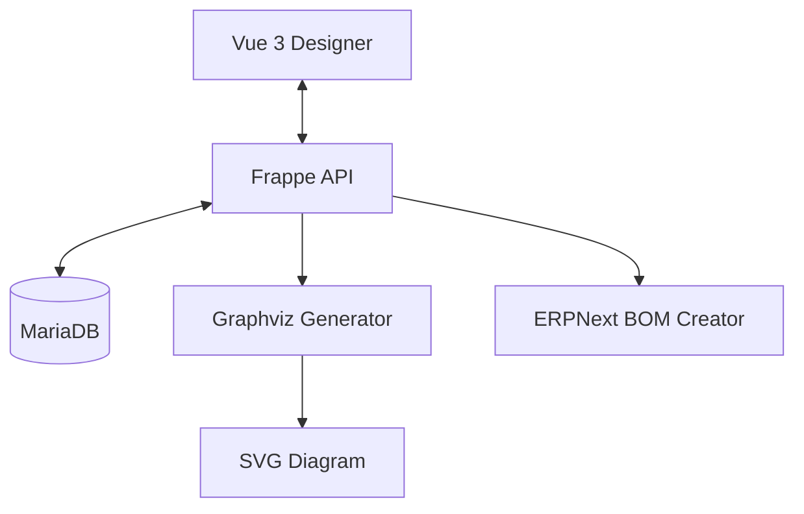

# System Patterns: BOM Creator

## Architecture Overview
BOM Creator follows the Frappe Framework's MVC pattern with a specialized Vue-based designer.

## Core Design Patterns

### Spec-Driven Items
Items in ERPNext are enriched with "Spec" DocTypes.
- **Spec Role**: Determines if an Item is a Connector, Cable, or Terminal.
- **Validation**: Server-side hooks check Spec data whenever a BOM Build is saved.

### Deterministic Revisioning
- **Hashing**: A SHA-256 hash is generated from the JSON representation of nodes and connections.
- **Immutability**: Once a BOM Build is "Released," it cannot be edited. Any changes require a new revision.

### Data Model Hierarchy
1. **BOM Build**: The parent document.
2. **BOM Build Node**: Child table representing instances of items (Connectors, Cables).
3. **BOM Build Connection**: Child table representing the wiring logic.

## Logic Flows

### BOM Generation
1. Validate all connections.
2. Aggregate Node quantities.
3. Calculate Cable lengths based on connection data or overrides.
4. Derive Terminal quantities (Qty = 1 per connected pin).
5. Create/Update standard ERPNext BOM.

### Diagram Generation
1. Parse `BOM Build Connection` table.
2. Generate DOT language script.
3. Call `dot` binary to render SVG.
4. Store SVG in File Manager and link to BOM Build.
